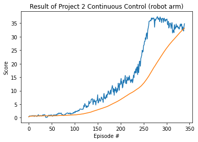

# project 1 : Continuous Control
This repo deal with a second deep reinforcement learing project of udacity.
In the project, I will implement a multi agent learning.
The purpose of this project is 

**Note : The version of pytorch is 1.4.0. The original version from udacity is 0.4.0. Due to the version of numpy, I upgraded the version of pytorch.**

## **Prerequisites**
- OS: Ubuntu 20.04
- anaconda
- setup virtual environment using 'python' folder


## How to start
This project is supposed that you have anaconda.

**0. clone this repository**
   ```bash
   mkdir project_1
   cd project_1
   git clone https://github.com/yesming/project_1_navigation.git
   ```
Now you can see the repository 'project_1_navigation'.

**1. activate virtual environment**
```bash
conda create --name drlnd python=3.6
source activate drlnd
```

**2. Environment setup and Execute**
```bash
cd p1_navigation/python
pip install .
```
you can see the file **'./p2_continuous-control/My_Proj_Continuous_Control.ipynb'**
Execute the file on the jupyter environment.

-------
## Goal of Project
If the average of those average scores is at least +30, then I will consider that the learning is over. 

## Environment (Reward and Evaluate)
In the environemnt, a double-jointed robot arm can move to target location (in 3 dimensions). A reward of +0.1 is provided for each step that the agent's hand in the goal location.
Thus, the goal of the agent is to maintain its position at the target location for as many time steps as possible.

In this project, I trained 20 identical agents, each with its own copy of the environment.


## State Space
The observation space consists of 33 variables corresponding to position, rotation, velocity and angular velocities of the arm.

## Actions
Each action is a vector with four numbers, corresponding to torque applicable to two joints. Every entry in the action vector should be a number between -1 and 1.
$$ A \in [-1, 1] $$


## Result
The agent was successfully learned the purpose (which is to reach and stay in the goal location). At the end of learning, the agents get a reward more than 

First video(.gif) shows the early phase of the learning.
The agents cannot maintain the goal position at all.

However, in the second video(.gif) which is the final phase of the learning, they can stay in the goal position. 

The average scores is over +30. 

<br/>

Video of the early phase :


Video of the final phase :


Result figure:
