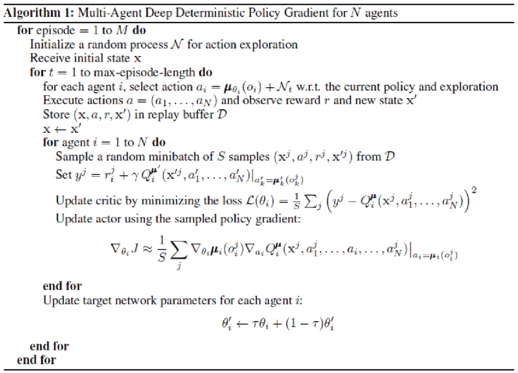

# Udacity - Deep Reinforcement Learning
## Second Project - **Continuous Control**
------
------
# Table of Contents
- [Udacity - Deep Reinforcement Learning](#udacity---deep-reinforcement-learning)
  - [Second Project - **Continuous Control**](#second-project---continuous-control)
- [Table of Contents](#table-of-contents)
  - [Environment](#environment)
  - [Purpose of Learning](#purpose-of-learning)
  - [State Space](#state-space)
  - [Actions](#actions)
  - [Learning Algorithm](#learning-algorithm)
  - [Hyper parameter](#hyper-parameter)
  - [Result](#result)

## Environment
In this project,  a double-jointed arm can move to target location. A reward of +0.1 is provided for each step that the agent's hand is in the goal location.
Also, in this project, it contains 20 identical agents, each with its own copy of the environment.


The Unity Environment is prepared at "../Reacher.x86_64".
It can be implemented in out code as below :
```python
env = UnityEnvironment(file_name="../Reacher.x86_64")
```

## Purpose of Learning
The purpose of this project (= the agent) is to stay in the target location as long as possible.

## State Space
The observation space consists of 33 variables corresponding to position, rotation, velocity, and angular velocities of the arm.


## Actions
The actions is determined between [-1, 1].
$$
Actions, A \in [-1, 1]
$$

## Learning Algorithm
In this project, DDPG algorithm is implemented.

- Actor :
  - An input layer consists of 33(= state size) neurons.
  - A first hidden layer of 400 neurons.
  - A second hidden layer of 300 neurons.
  - An output layer of 4(= action vector) neurons.

The input layer and output layer are determined by properties of agent and observer. The rest part is up to the developer.

- Critic :
  - An input layer consists of 33(= state size) neurons.
  - A first hidden layer of 400+4(4 : action size) neurons.
  - A second hidden layer of 300 neurons.
  - An output layer of 1(= action size) neurons.
The output layer must have only one neurons.

The implemented code is showan as below :
```python
# Actor Network (w/ Target Network)
self.actor_local = Actor(state_size, action_size, random_seed).to(device)
self.actor_target = Actor(state_size, action_size, random_seed).to(device)
self.actor_optimizer = optim.Adam(self.actor_local.parameters(), lr=LR_ACTOR)

# Critic Network (w/ Target Network)
self.critic_local = Critic(state_size, action_size, random_seed).to(device)
self.critic_target = Critic(state_size, action_size, random_seed).to(device)
self.critic_optimizer = optim.Adam(self.critic_local.parameters(), lr=LR_CRITIC, weight_decay=WEIGHT_DECAY)
```


## Hyper parameter
```python
BUFFER_SIZE = int(1e6)  # replay buffer size
BATCH_SIZE = 128        # minibatch size
GAMMA = 0.99            # discount factor
TAU = 1e-3              # for soft update of target parameters
LR_ACTOR = 1e-4         # learning rate of the actor 
LR_CRITIC = 3e-4        # learning rate of the critic
WEIGHT_DECAY = 0.0001   # L2 weight decay
```

## Result 
The all 20 agents learned the strategy how to maintain its hand on the goal position for about 350 episodes.

The simulatio is end according to the below code :
```python
if np.mean(scores_window) >= 33.0 and i_episode > 100:
    # To terminate when the agent reaches to the target score.
    return scores, score_changes_to_plot
```
According to the below figure and video, the learning is sucess (The average score is about 33.(30 is the criteria whether learning is success or not).


